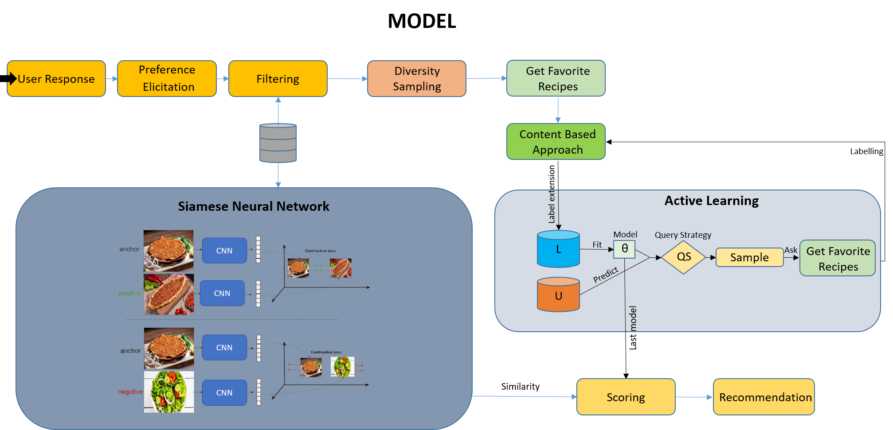

# Personalized Health-Aware Recipe Recommendation

<h3> Abstract </h3>

Recommendation Systems have great potential to facilitate the daily habits and requirements of people. 
Food Recommender System aims to help people choose food. 
There are lots of factors that affect food choices for humans such as smell, the appearance of food, price of food, etc.
Therefore, it is hard to consider whole factors while recommending. Moreover, since the food related recommendations directly can affect people’s health, 
it is a delicate subject and this makes it inevitable to consider people's health in food recommendation.
Previous studies in that field have various  approaches with small subsets of these factors. However, there is no much study that considers whole factors in a comprehensive way.
In this project, we created a comprehensive approach by considering nutritional needs, the
appearance of food, the important level of factors, and health conditions.
In the application, our model evaluates both personal preferences and health factor.

 

Data: <a href="https://www.kaggle.com/datasets/elisaxxygao/foodrecsysv1?resource=download&select=core-data_recipe.csv">foodRecSys</a>
